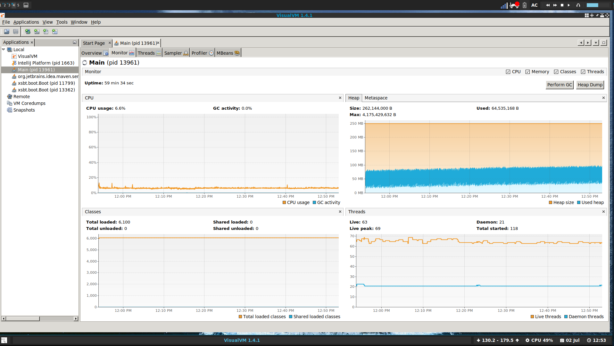
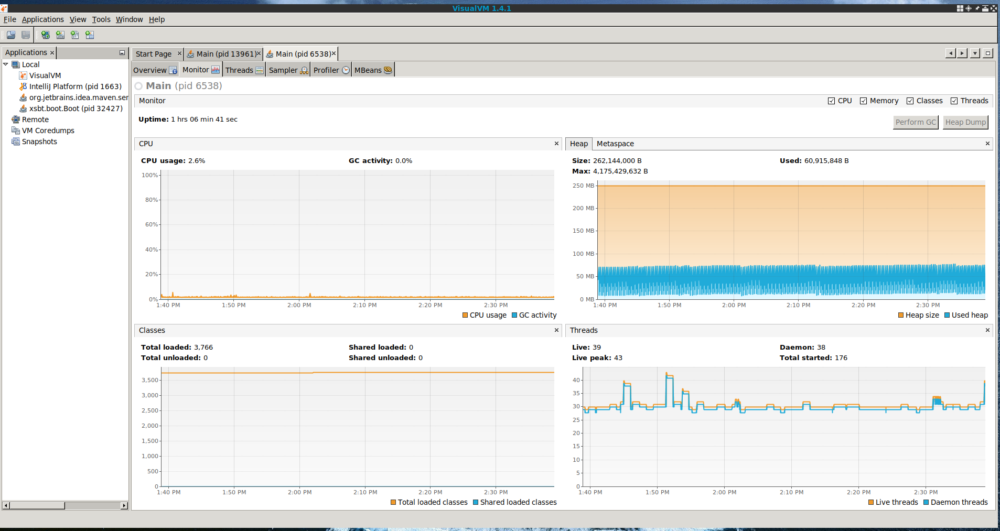

## Task-Doobie memory leak

This repo demonstrates the memory leak that is happening when you combine monix
task with doobie (in the context of using a Postgres database with HikariCP).

The repo contains two projects, one named `taskDoobie` and the other named `taskQuill`.
This is to have a point of reference in determining the leak, the `taskQuill` project has no such leak.
The two projects (apart from `quill`/`doobie` have the exact same dependency tree) and the code
testing the benchmark is as similar as possible between the two

## Running the projects

Firstly you need a running postgres database, the easiest way to do this is to use Docker

```
docker run --name task-doobie-postgres-db -p 5432:5432  -e POSTGRES_PASSWORD=mysecretpassword -e POSTGRES_DB=postgres -d postgres
```

Once the database is up, you simply need to either run `taskDoobie/run` or `taskQuill/run` which will run the respective
projects with the running leak. You can then attach jProfiler or VisualVM to
the forked Java process to have a look at the memory/heap. It takes ~35-40 minutes
for the `taskDoobie` leak to be visible. The transactions are scheduled with a Monix
scheduler (see `scheduler.scheduleWithFixedDelay` in `Main.scala`). You can make
the transactions run more often to speed up the leak however you may need to increase
the number of connections on postgres side.

## Notes

For `taskDoobie` we use `Task.deferFuture(connectionIO.transact(xa).unsafeToFuture())` (see `TaskHelper.scala`).
Its also possible to just `Task` as the cats-effect IO type the leak however the leak still persists (I was just
experimenting with various combinations to see the origin of the leak).

## Leaks
Here is an image showing the heap usage over time for `taskDoobie` (demonstrating the leak)




And here is an image showing the heap usage over time for `taskQuill` (without a leak)


